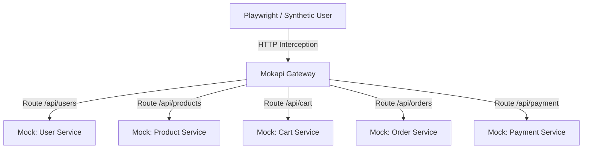

# 📦 CommercePulse
## Microservices Synthetic Monitoring & Testing Framework


---

### 🚀 Overview

**CommercePulse** is a robust, enterprise-grade framework designed to demonstrate advanced **Microservices Testing**, **Synthetic Monitoring**, and **Mock-Driven Development**. It simulates a complex e-commerce architecture (User, Product, Cart, Order, Payment) entirely locally, enabling high-fidelity isolated testing without the overhead of live backend infrastructure.

This project serves as a reference implementation for:
-   **QA Automation testing** for decoupled microservices.
-   **Synthetic Monitoring** of critical business flows.
-   **Chaos Engineering** simulation using dynamic mocks.

---

### 🏗️ Architecture

The system mimics a real-world distributed microservices environment. **Playwright** acts as the test runner and synthetic user, while **Mokapi** mocks the backend services, allowing for deterministic and flaky-test-free validation.



### 🛠️ Technology Stack

| Component | Technology | Role |
| :--- | :--- | :--- |
| **Test Runner** | [Playwright](https://playwright.dev/) | End-to-End & API Testing |
| **Language** | [TypeScript](https://www.typescriptlang.org/) | Type-safe development |
| **Mock Server** | [Mokapi](https://mokapi.io/) | API Mocking & Chaos Simulation |
| **Containerization** | [Docker](https://www.docker.com/) | Consistent environment setup |
| **Monitoring** | [Prometheus](https://prometheus.io/) | Metrics collection (Optional) |
| **Visualization** | [Grafana](https://grafana.com/) | Test result dashboards (Optional) |

---

### 📂 Folder Structure

```
commercepulse/
├── mokapi/                  # 🛠️ Service Mocks Configuration
│   ├── mokapi.yaml          # Main configuration file
│   └── data/                # Static data fixtures
│       ├── users.json
│       ├── products.json
│       └── orders.json
├── src/                     # 🧪 Test Automation Source
│   ├── pages/               # Page Object Models (POM)
│   └── fixtures/            # Test Data & Custom Fixtures
├── tests/                   # 🧪 Test Specifications
│   └── login.spec.ts
│   └── checkout.spec.ts
├── playwright.config.ts     # Framework Configuration
├── package.json             # Dependencies
├── Dockerfile               # (Optional)
├── docker-compose.yml       # 🐳 Container Orchestration
└── README.md                # 📄 Documentation
```

---

### 🧩 Key Features

#### 1. Zero-Dependency Mocking
Run full e-commerce flows without a single running backend service. Mokapi handles all routing, logic, and state management for:
-   **User Service**: Authentication simulation.
-   **Product Service**: Dynamic inventory catalogs.
-   **Order Service**: Order creation and id generation logic.

#### 2. Synthetic, Production-Grade Tests
Playwright tests are designed not just for functional verification but for performance baselining.
-   **Hybrid Testing**: Combines API-level heavy lifting with UI verification.
-   **Network Interception**: Validates how the frontend handles delayed or failed API responses.

#### 3. Chaos Engineering Ready
The framework supports failure injection to test resilience:
-   Simulate **503 Service Unavailable**.
-   Introduce **High Latency** (Network throttling).
-   Inject **Malformed JSON** responses.

---

### ⚙️ Getting Started

#### Prerequisites
-   [Node.js](https://nodejs.org/) (v16+)
-   [Docker](https://www.docker.com/) (Recommended) OR [Mokapi CLI](https://mokapi.io/docs/installation)

#### Installation

1.  **Clone the Repository**
    ```bash
    git clone https://github.com/yourusername/commercepulse.git
    cd commercepulse
    ```

2.  **Install Dependencies**
    ```bash
    npm install
    npx playwright install --with-deps
    ```

### ▶️ Usage

#### Option A: Running with Docker (Recommended)
This starts both the mock server and runs the tests in a containerized environment.

```bash
docker-compose up -d
```

#### Option B: Local Execution

1.  **Start Mock Services**
    In a new terminal:
    ```bash
    mokapi start --config ./mokapi/mokapi.yaml
    ```

2.  **Run Tests**
    ```bash
    npx playwright test
    ```

3.  **View Report**
    ```bash
    npx playwright show-report
    ```

---

### 🧪 Testing Strategy

The project utilizes a pyramid testing approach:

-   **E2E (Top)**: Critical user paths (Login -> Checkout).
-   **Integration (Middle)**: API contract testing against mocks.
-   **Visual Regression (Optional)**: Snapshot testing for UI components.

---
**Author**: Mukul
**License**: MIT
